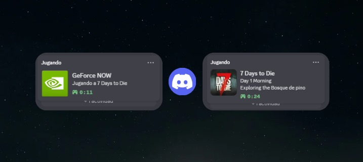
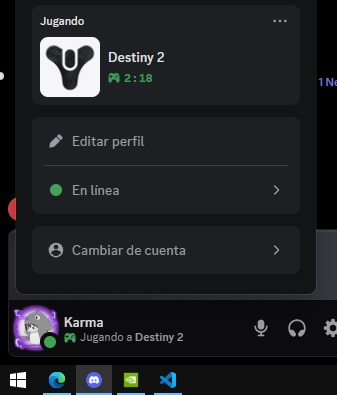
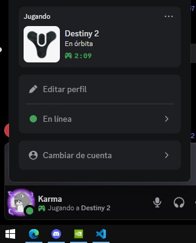

 GeForce NOW Rich Presence for Discord:
Automatically show your real GeForce NOW game in your Discord Rich Presence  
Perfect for Discord Quests, GFN users, and streamers who want their status updated beautifully in real time. 

[🇪🇸 Leer en Español](./README.es.md)

<h1 align="center">🎮 GeForce NOW Rich Presence for Discord</h1>

  Show your real game on Discord while playing on <strong>GeForce NOW</strong> — automatically and beautifully.
    
  

  

---

## 🕹️ What is this?

**GeForce NOW Rich Presence for Discord** lets you display the **actual game you're playing on GeForce NOW** directly on your Discord profile.  
No more just “Playing GeForce NOW” — now it shows the **real title, image, and custom status** in real time.

Perfect for streamers, gamers, and anyone who loves showing off what they’re playing 🎮💚

---

## ✨ Features

- ✅ **Automatic detection** of the game you're running on GeForce NOW  
- ✅ Displays **real game names and images** on Discord  
- ✅ **Tray icon menu** to force a game, open GeForce NOW, or exit easily  
- ✅ Works out of the box — **no Python, no setup, no configuration**  
- ✅ Lightweight installer built with **Inno Setup**  
- ✅ Fully compatible with Windows and Discord Desktop

---

## 📦 Installation

1. Click the button above or go to the [**Latest Release**](https://github.com/KarmaDevz/discord-rich-presence-for-geforcenow/releases/latest).  
2. Download the installer `.exe` file.  
3. Run the installer and follow the simple steps.  
4. Once installed, just open the app — it will automatically detect your GeForce NOW session and update your Discord Rich Presence.  
5. That’s it! Sit back and let your friends see what you’re playing 😎  

---

## 🧠 How it works (simplified)

The app runs quietly in the background and:
- Detects when a game is launched on **GeForce NOW**  
- Matches it with a built-in game list  
- Sends the correct **Rich Presence** to Discord  
- Updates it automatically as long as the game is running  

It’s 100% automatic — no need to configure anything.

---

## 🪄 Tray Icon Options

When running, the app shows an icon in your Windows tray (bottom-right corner).  
From there, you can:
- 🎮 **Force Game** — manually choose which game to display  
- 🔄 **Restart Detection** — refresh the current session  
- 🚀 **Open GeForce NOW**  
- ❌ **Exit the app**

---

## 🖼️ Screenshots

  
  

---

## 🧩 FAQ

**Q: Do I need Python or any dependencies?**  
A: Nope! Everything is bundled — just install and run.

**Q: Does it work with Steam or Epic Games?**  
A: Yes! It detects games streamed through GeForce NOW, regardless of the platform.

**Q: Is it safe?**  
A: 100%. No login or account information is required.

---

## 💬 About

This project was created by [**KarmaDevz**](https://github.com/KarmaDevz) to make **GeForce NOW + Discord** integration as smooth and automatic as possible.  
If you like it, consider giving the repo a ⭐ on GitHub!

---

  

