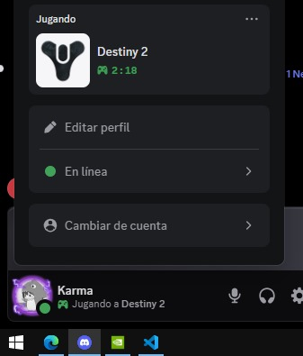
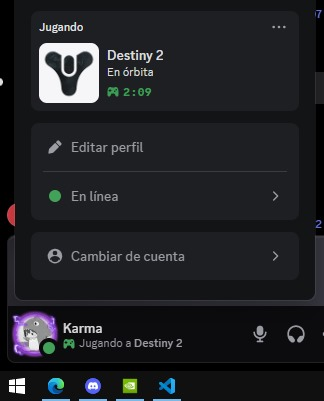

# 🎮 GeForce Presence — Discord Rich Presence para GeForce NOW

<p align="center">
  <a href="https://github.com/KarmaDevz/discord-rich-presence-for-geforcenow/releases/latest">
    
  </a>
</p>

---

<div align="center">

  
  

</div>
Herramienta que muestra la presencia (Rich Presence) en Discord de lo que estás ejecutando en **GeForce NOW**.

### Características principales

* Detecta el juego activo en GeForce NOW.
* Cambia dinámicamente el `client_id` de Discord según el juego.
* Opcional: scraping de Steam para obtener texto de presencia detallado.
* Configuración externa mediante `.env` y `config/games_config_merged.json`.
* Instalador (Inno Setup) disponible para usuarios finales.

---

## 📦 Instalación (Usuarios)

1. Descarga el instalador:

   * `GeForcePresenceSetup.exe` (generado con Inno Setup).

2. Ejecuta el instalador y sigue el asistente.

   * Por defecto la app se instala en:

     ```text
     %APPDATA%\geforce_presence
     ```
   * Se crean accesos directos en el **Menú Inicio** (y opcionalmente en el Escritorio).

> **Nota:** El instalador está listo y disponible para descarga. Revisa el último release.

---

## ⚙️ Configuración

Los archivos de configuración principales viven en `%APPDATA%\geforce_presence`.

### `.env` (ejemplo)

```env
CLIENT_ID=1095416975028650046
UPDATE_INTERVAL=10
CONFIG_PATH_FILE=
TEST_RICH_URL=https://steamcommunity.com/dev/testrichpresence
STEAM_COOKIE=
```

* `CLIENT_ID`: ID por defecto para la presencia en Discord.
* `TEST_RICH_URL`: URL usada para obtener el rich presence desde Steam (opcional).
* `STEAM_COOKIE`: `steamLoginSecure` (opcional) — mejora la información de presencia.
* `CONFIG_PATH_FILE`: ruta al `games_config.json` que se usará por defecto (el instalador y la app intentan crear/usar `%APPDATA%\geforce_presence\config\games_config_merged.json`).


## ▶️ Uso

1. Ejecuta el acceso directo creado por el instalador o ejecuta directamente:

   ```cmd
   %APPDATA%\geforce_presence\geforce_presence.exe
   ```
2. La aplicación intentará abrir Discord y GeForce NOW (según tu configuración).
3. Si no hay `CONFIG_PATH_FILE` configurado, al abrir por primera vez te pedirá seleccionar el `games_config.json`.

> **Comportamiento actual**: al seleccionar el `games_config.json` mediante diálogo, la app guarda la ruta elegida en `%APPDATA%\geforce_presence\config_path.txt`.
> 
---

## 📜 Licencia
El programa **GeForce Presence** se distribuye únicamente en formato compilado bajo una licencia de uso binario.  
Puedes usarlo y compartirlo con crédito al autor (**KarmaDevz**), pero no está permitido modificarlo ni usarlo con fines comerciales.
Ver el archivo [LICENSE](LICENSE) para más detalles.


## 💬 Créditos

* `pypresence` — Discord Rich Presence
* `BeautifulSoup` — análisis HTML
* `Inno Setup` — Instalador
* `PyInstaller` — Empaquetado de ejecutable
